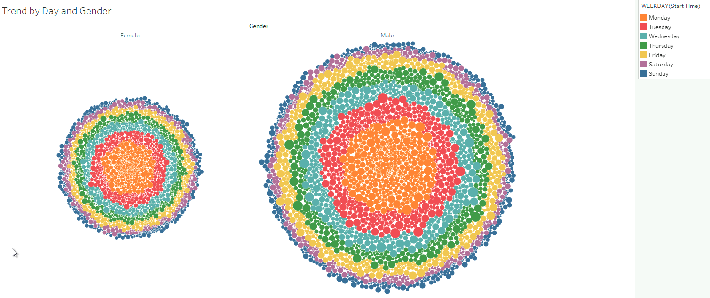
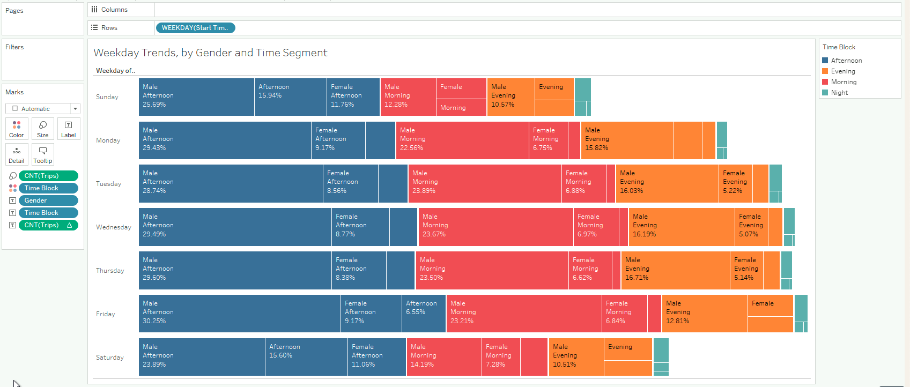
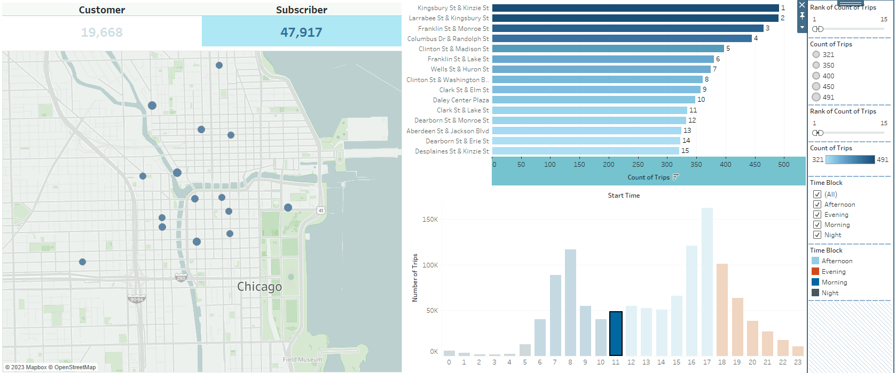
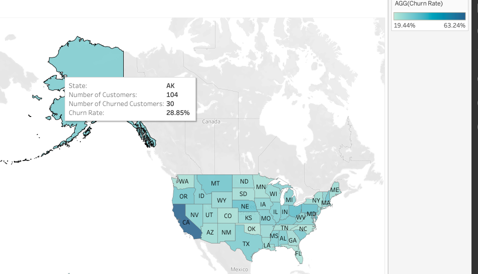
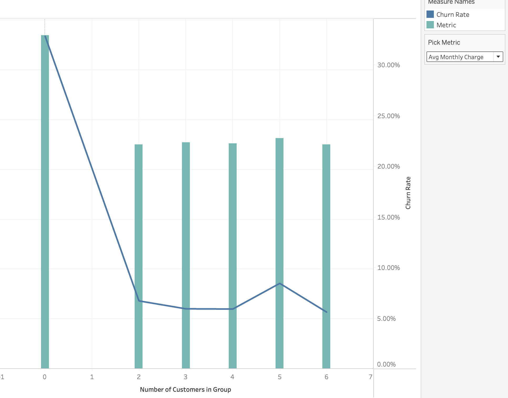
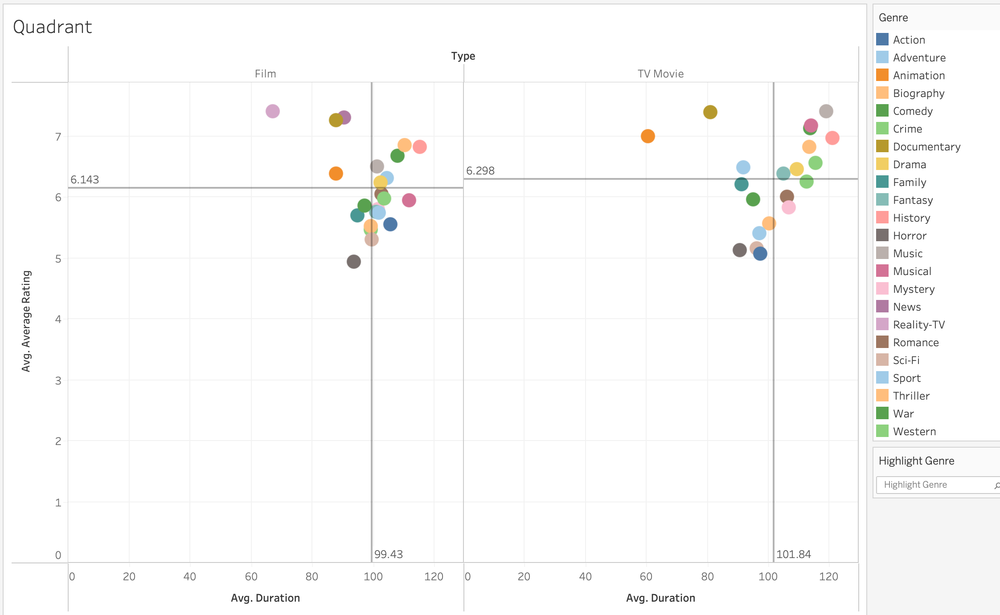
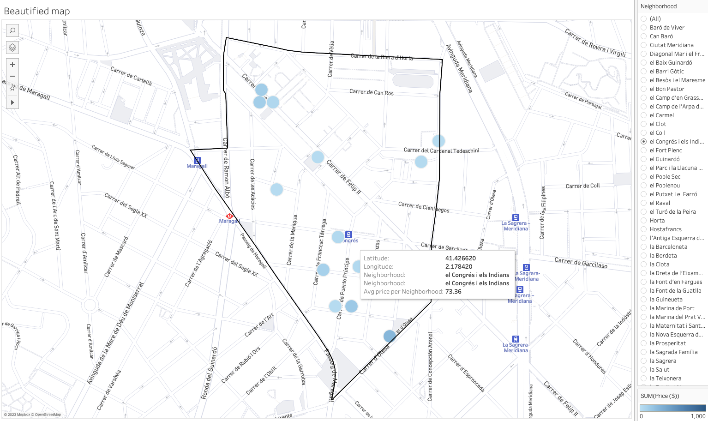
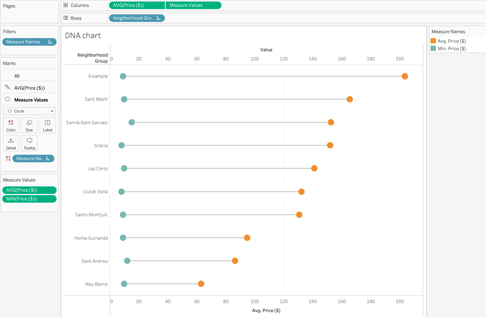
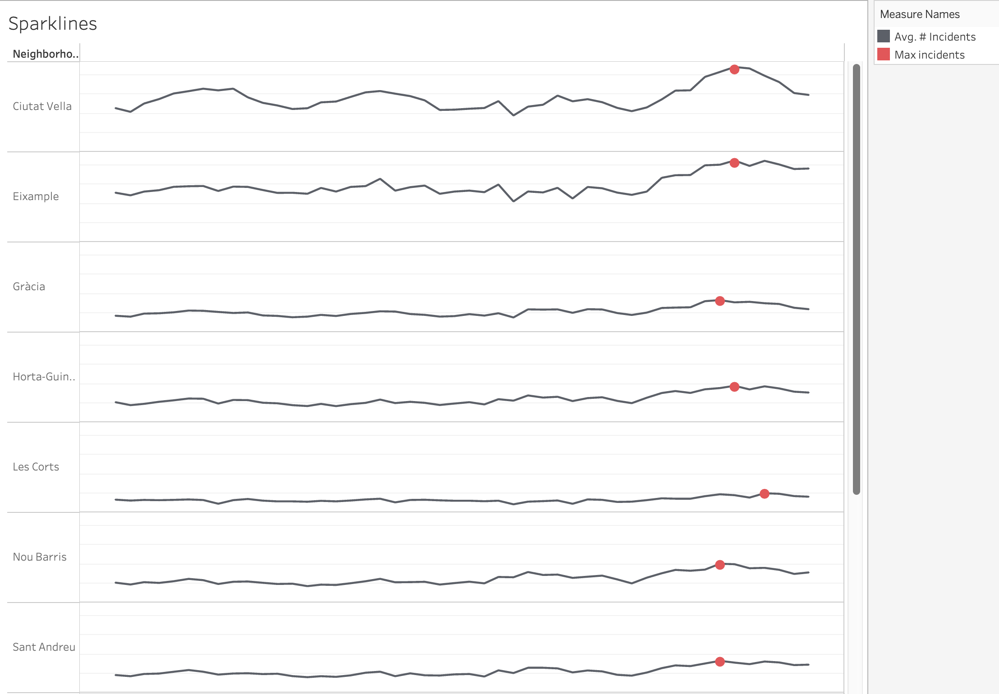

# 66 Days of Data Science

 

### Resources

    

        
 &nbsp; 🔖 &nbsp; Coursera 

        <ul>
            <li>
                <a href="https://www.coursera.org/specializations/applied-data-science" target="_blank">Applied Data Science Specialization</a> by IBM
            </li>
        </ul>
    

    

        
 &nbsp; 🔖 &nbsp; Datacamp 

        <ul>
            <li>
                <a href="https://app.datacamp.com/learn/career-tracks/data-analyst-in-sql" target="_blank">Data Analyst in SQL</a> : Career track
            </li>
            <li>
                <a href="https://app.datacamp.com/learn/career-tracks/data-analyst-in-tableau" target="_blank">Data Analyst in Tableau</a> : Career track
            </li>
        </ul>
    

    

        
 &nbsp; 🔖 &nbsp; Kaggle Learn 

        <ul>
            <li>
                <a href="https://www.kaggle.com/learn/intro-to-programming" target="_blank">Intro to Programming</a>
            </li>
            <li>
                <a href="https://www.kaggle.com/learn/intro-to-ai-ethics" target="_blank">Intro to AI Ethics</a>
            </li>
            <li>
                <a href="https://www.kaggle.com/learn/intro-to-sql" target="_blank">Intro to SQL</a>
            </li>
            <li>
                <a href="https://www.kaggle.com/learn/advanced-sql" target="_blank">Advanced SQL</a>
            </li>
            <li>
                <a href="https://www.kaggle.com/learn/pandas" target="_blank">Pandas</a>
            </li>
            <li>
                <a href="https://www.kaggle.com/learn/data-cleaning" target="_blank">Data Cleaning</a>
            </li>
        </ul>
    

    

        
 &nbsp; 🔖 &nbsp; LinkedIn learing 

        <ul>
            <li>
                <a href="https://www.linkedin.com/learning/paths/become-a-data-scientist" target="_blank">Become a Data Scientist</a>
            </li>
        </ul>
    

    

        
 &nbsp; 📼 &nbsp; Youtube Playlist 

        <ul>
            <li>
                <a href="https://youtube.com/playlist?list=PLvxOuBpazmsNIHP5cz37oOPZx0JKyNszN" target="_blank">Discrete Probability Distributions</a>
            </li>
        </ul>
    

 

### The Journey

     
    
 &nbsp; 📖 &nbsp; Day 1 - Revision of Statistics and Basic SQL 

    <pre><code><small>🗓️ Date: 2023-02-15</small></code></pre>
    <h4> Resources : </h4>
    
Course

    <ul>
        <li>
            <a href="https://app.datacamp.com/learn/courses/introduction-to-statistics" target="_blank">Introduction to Statistics (Datacamp)</a>
        </li>
        <li>
            <a href="https://app.datacamp.com/learn/courses/introduction-to-sql" target="_blank">Introduction to SQL (Datacamp)</a>
        </li>
    </ul>
    

        

    

    <h4> Summary : </h4>
    
 While taking the course <a href="https://app.datacamp.com/learn/courses/introduction-to-statistics" target="_blank">Introduction to Statistics</a> as part of the track <a href="https://app.datacamp.com/learn/career-tracks/data-analyst-in-sql" target="_blank">Data Analyst in SQL,</a> I had the chance to review probability, distributions, the central limit theorem, correlation, and hypothesis testing. While revising the dependence and conditional probabilities, I was also able to recall the normal and poisson distributions (k = * n). 

    
 I also took <a href="https://app.datacamp.com/learn/courses/introduction-to-sql" target="_blank">Introduction to SQL</a> as part of the same curriculum, which helped me revise the basic sql queries to read and view data from tables. Because of this revision, I learned about "VIEW," a concept I was never aware of before. To summarize, views are virtual tables whose contents are determined by queries. It only allows you to restrict access to the database and does not significantly increase the performance of SQL queries. Nonetheless, it was a useful trick to have in my SQL toolbox for increasing readability. 

     
 

     
    
 &nbsp; 📖 &nbsp; Day 2 - Revision of Intermediate SQL Queries 

    <pre><code><small>🗓️  Date: 2023-02-16</small></code></pre>
    <h4> Resources : </h4>
    
Course

    <ul>
        <li>
            <a href="https://app.datacamp.com/learn/courses/intermediate-sql" target="_blank">Intermediate SQL (Datacamp)</a>
        </li>
    </ul>
    

        

    

    <h4> Summary : </h4>
    
 Continuing on from Day 1, I chose the <a href="https://app.datacamp.com/learn/courses/intermediate-sql" target="_blank">Intermediate SQL</a> course from the same track, which included queries for selecting, filtering, aggregating, sorting, and grouping. Unlike the previous time, I did not get to learn a new concept, but it was a good recollection of all these principles, particularly concerning conventions for writing SQL to promote readability, as I had become a little sloopy regarding this. 

     
 

     
    
 &nbsp; 📖 &nbsp; Day 3 - Revision of Joins, Set theory & Subqueries in SQL 

    <pre><code><small>🗓️  Date: 2023-02-17</small></code></pre>
    <h4> Resources : </h4>
    
Course

    <ul>
        <li>
            <a href="https://app.datacamp.com/learn/courses/joining-data-in-sql" target="_blank">Joining Data in SQL (Datacamp)</a>
        </li>
    </ul>
    

        

    

    <h4> Summary : </h4>
    
 I took the course <a href="https://app.datacamp.com/learn/courses/joining-data-in-sql" target="_blank">Joining Data in SQL</a>, the fifth Course under the track <a href="https://app.datacamp.com/learn/career-tracks/data-analyst-in-sql" target="_blank">Data Analyst in SQL</a>. It included an introduction to various types of joins (inner, outer, cross & self) as well as set theory (union, intersect & except) joins. The cross joins and set theory section was incredibly beneficial as my perspective on desiging tables using minimal readable query was expanded due to these concepts. While I recall reading about it in my undergrad curriculum, putting it into practice has helped me comprehend it much better. In addition, subqueries in the "WHERE", "FROM" and "SELECT" keywords were covered in the course. I had never used subqueries in the "SELECT" & "FROM" section before, hence I learned some cool tricks up my sleeves. I have added some syntaxes that I learned as follows: 

    

        

    

    <h4> Notes : </h4>
    

        
 &nbsp; Cross Join Query

        <pre><code><small>--- Creates all possible combinations
SELECT column_name(s)
FROM table1
CROSS JOIN table2;</small></code></pre>
    

    

        
 &nbsp; Operators

        <pre><code><small>--- UNION Operator : shows unique rows
SELECT column_name(s) FROM table1
UNION
SELECT column_name(s) FROM table2;

--- UNION ALL Operator : shows duplicate rows
SELECT column_name(s) FROM table1
UNION ALL
SELECT column_name(s) FROM table2;

--- EXCEPT Operator : shows rows not present in the table
SELECT column_name(s) FROM table1
EXCEPT
SELECT column_name(s) FROM table2;</small></code></pre>

 &nbsp; Subquery

<pre><code><small>--- Example 1: Sub query with in WHERE
SELECT name, country_code
FROM cities
WHERE name in (
SELECT capital
FROM countries
)

--- Example 2: Sub query with in SELECT
SELECT countries.name AS country_name, (
SELECT COUNT(\*)
FROM cities
WHERE cities.country_code = country.code
) AS cities_num
FROM countries

--- Example 3: Sub query with in FROM
SELECT coutries.name AS country_name, lang_num
FROM countries,
(SELECT code, COUNT(\*) AS lang_num
FROM languages
GROUP BY code) AS sub
WHERE countries.code = sub.code
ORDER BY lang_num DESC;</small></code></pre>

 
 

     
    
 &nbsp; 📖 &nbsp; Day 4 - Exploring Data Manipulation in SQL 

    <pre><code><small>🗓️  Date: 2023-02-20</small></code></pre>
    <h4> Resources : </h4>
    
Course

    <ul>
        <li>
            <a href="https://app.datacamp.com/learn/courses/data-manipulation-in-sql" target="_blank">Data Manipulation in SQL (Datacamp)</a>
        </li>
    </ul>
    

        

    

    <h4> Summary : </h4>
    
 Machine learning, the most trending topic in today's generation is nothing more than a series of if and else statements. With SQL, a similar scenario occurs when you use the CASE statement to insert new values into a table based on existing records. To be more specific, the first module in <a href="https://app.datacamp.com/learn/courses/data-manipulation-in-sql" target="_blank">Data Manipulation in SQL</a> that I took,' 'We'll Take the CASE' module focused on using case statements to generate labels, probability, and percentage based on supplied criteria. While accounting for only one-quarter of the course, this subject proved useful in a variety of ways. The following are some examples of the statement: 

    

        

    

    <h4> Notes : </h4>
    

        
 &nbsp; CASE Statement

        <pre><code><small>--- Example 1 : Basic
SELECT title,
    length,
    CASE
        WHEN length> 0 AND length <= 50
            THEN 'Short'
        WHEN length > 50 AND length <= 120
            THEN 'Medium'
        WHEN length> 120
            THEN 'Long'
        ELSE
            'Outlier'
    END AS duration
FROM film
ORDER BY title;

 
--- Example 2 : Count
SELECT
c.name AS country,
-- Count games from the 2012/2013 season
count(CASE WHEN m.season = '2012/2013'
THEN m.id ELSE NULL end) AS matches_2012_2013
FROM country AS c
LEFT JOIN match AS m
ON c.id = m.country_id
-- Group by country name alias
GROUP BY country;

--- Example 3 : Percentage
SELECT
c.name AS country,
-- Round the percentage of tied games to 2 decimal points
ROUND(AVG(CASE WHEN m.season='2013/2014' AND m.home_goal = m.away_goal THEN 1
WHEN m.season='2013/2014' AND m.home_goal != m.away_goal THEN 0
END),2) AS pct_ties_2013_2014,
ROUND(AVG(CASE WHEN m.season='2014/2015' AND m.home_goal = m.away_goal THEN 1
WHEN m.season='2014/2015' AND m.home_goal != m.away_goal THEN 0
END),2) AS pct_ties_2014_2015
FROM country AS c
LEFT JOIN matches AS m
ON c.id = m.country_id
GROUP BY country;
</small></code></pre>

 
 

     
    
 &nbsp; 📖 &nbsp; Day 5 - (Continued) Data Manipulation in SQL

    <pre><code><small>🗓️  Date: 2023-02-21</small></code></pre>
    <h4> Resources : </h4>
    
Course

    <ul>
        <li>
            <a href="https://app.datacamp.com/learn/courses/data-manipulation-in-sql" target="_blank">Data Manipulation in SQL (Datacamp)</a>
        </li>
    </ul>
    

        

    

    <h4> Summary : </h4>
    
 Continuing the remaining modules <a href="https://app.datacamp.com/learn/courses/data-manipulation-in-sql" target="_blank">Data Manipulation in SQL</a> course, I was able to gain insights on Simple Subqueires Joins, Correlated Subqueries (takes higher processing time), Multiple/Nested Subqueries, and Common Table Expressions (CTE). These concepts were handful in allowing to perform complex actions within SQL and gain data points that I once thought were only possible through pandas (a python library). 

    
 However, more significantly, I learned about window functions and the various types, such as Over, Rank, Partition, and Slide, throughout this course. While I had seen it before, I had never utilized it in practice, and I am pleased that this course allowed me to do so. Aggregating on columns that aren't in the grouping columns is likely the most useful skill to have, especially when doing comparative analysis. 

    

        

    

    <h4> Notes : </h4>
    

        
 &nbsp; Correlated subquery with multiple conditions

        <pre><code><small>SELECT
    -- Select country ID, date, home, and away goals from match
    main.country_id,
    main.date,
    main.home_goal,
    main.away_goal
FROM match AS main
WHERE
    -- Filter for matches with the highest number of goals scored
    (home_goal + away_goal) >
        (SELECT MAX(home_goal + sub.away_goal)
        FROM match AS sub
        WHERE main.country_id = sub.country_id
            AND main.season = sub.season);</small></code></pre>
    

    

        
 &nbsp; Common Table Expressions

        <pre><code><small>WITH match_list AS (
    SELECT
        country_id,
        id
    FROM match
-- Select league and count of matches from the CTE
SELECT
    l.name AS league,
    COUNT(match_list.id) AS matches
FROM league AS l
-- Join the CTE to the league table
LEFT JOIN match_list ON l.id = match_list.country_id
GROUP BY l.name;</small></code></pre>
    

    

        
 &nbsp; Window Function

        <pre><code><small>-- Example 1 : Over function
SELECT
    m.id,
    c.name AS country,
    m.season,
    m.home_goal,
    m.away_goal,
    -- Use a window to include the aggregate average in each row
    AVG(m.home_goal + m.away_goal) OVER() AS overall_avg
FROM match AS m
LEFT JOIN country AS c ON m.country_id = c.id;

-- Example 2 : Rank function
SELECT
l.name AS league,
AVG(m.home_goal + m.away_goal) AS avg_goals,
-- Rank each league according to the average goals
RANK() OVER(ORDER BY AVG(m.home_goal + m.away_goal) DESC) AS league_rank
FROM league AS l
LEFT JOIN match AS m
ON l.id = m.country_id
WHERE m.season = '2011/2012'
GROUP BY l.name
ORDER BY league_rank;

-- Example 3 : Partition function

SELECT
c.name,
m.season,
(home_goal + away_goal) AS goals,
AVG(home_goal + away_goal)
OVER(PARTITION BY m.season, c.name) AS season_country_avg
FROM country AS c
LEFT JOIN match AS m
ON c.id = m.country_id;

-- Example 4 : Sliding Function

SELECT
date,
home_goal,
away_goal,
-- Create a running total and running average of home goals
SUM(home_goal) OVER(ORDER BY date
ROWS BETWEEN UNBOUNDED PRECEDING AND CURRENT ROW) AS running_total,
AVG(home_goal) OVER(ORDER BY date
ROWS BETWEEN UNBOUNDED PRECEDING AND CURRENT ROW) AS running_avg
FROM match
WHERE
hometeam_id = 9908
AND season = '2011/2012';</small></code></pre>

 
 

     
    
 &nbsp; 📖 &nbsp; Day 6 - Understanding PostgreSQL Summary Stats 

    <pre><code><small>🗓️  Date: 2023-02-22</small></code></pre>
    <h4> Resources : </h4>
    
Course

    <ul>
        <li>
            <a href="https://www.kaggle.com/learn/advanced-sql" target="_blank">Advanced SQL (Kaggle)</a>
        </li>
        <li>
            <a href="https://app.datacamp.com/learn/courses/postgresql-summary-stats-and-window-functions" target="_blank">PostgreSQL Summary Stats and Window Functions (Datacamp)</a>
        </li>
    </ul>
    
Articles

    <ul>
        <li>
            <a href="https://medium.com/yavar/window-functions-in-sql-a7239bb97104" target="_blank">Window functions in SQL (Medium)</a>
        </li>
    </ul>
    

        

    

    <h4> Summary : </h4>
    
 With the continuation of window functions, I have gotten slightly familiar with the notion of window function types, particularly fetching, framing, and ranking functions, which I had practiced today. While these functions seemed intimidating at first, they turned out to be considerably easy than I had anticipated. 

    
 Beside this, I attempted to put my knowledge into practice by answering practice questions in the "Advanced sql" section of kaggle. It was a valuable experience since I was able to accurately utilize window functions and also learn about the 'UNNEST' function to load nested and repeated data from the tables. 

    

        

    

    <h4> Notes : </h4>
    

        
 &nbsp; Fetching functions

        <table>
            <thead>
                <tr>
                    <th>Operator</th>
                    <th>Description</th>
                </tr>
            </thead>
            <tbody>
                <tr>
                    <td>
                        <code>LAG(column, n)</code>
                    </td>
                    <td>Returns column&#39;s value at the row <code>n</code> rows before the current row </td>
                </tr>
                <tr>
                    <td>
                        <code>LEAD(column, n)</code>
                    </td>
                    <td>Returns column&#39;s value at the row <code>n</code> rows after the current row </td>
                </tr>
                <tr>
                    <td>
                        <code>FIRST_VALUE(column)</code>
                    </td>
                    <td>Returns the first value in table or partition</td>
                </tr>
                <tr>
                    <td>
                        <code>LAST_VALUE(column)</code>
                    </td>
                    <td>Returns the last value in table or partition</td>
                </tr>
            </tbody>
        </table>
    

    

        
 &nbsp; Framing functions

        <table>
            <thead>
                <tr>
                    <th>Operator</th>
                    <th>Description</th>
                </tr>
            </thead>
            <tbody>
                <tr>
                    <td>ROW/RANGE</td>
                    <td>Uses the given row or range as a frame.</td>
                </tr>
                <tr>
                    <td>PRECEDING</td>
                    <td>Rows before the current row.</td>
                </tr>
                <tr>
                    <td>UNBOUNDED PRECEDING</td>
                    <td>Return all rows before the current row.</td>
                </tr>
                <tr>
                    <td>UNBOUNDED FOLLOWING</td>
                    <td>Return all rows after the current row.</td>
                </tr>
                <tr>
                    <td>CURRENT ROW</td>
                    <td>Current row of query execution.</td>
                </tr>
            </tbody>
        </table>
    

    

        
 &nbsp; Ranking Functions

        <table>
            <thead>
                <tr>
                    <th>Operator</th>
                    <th>Description</th>
                </tr>
            </thead>
            <tbody>
                <tr>
                    <td>ROW_NUMBER</td>
                    <td>Unique sequential number for each row in the specified partition</td>
                </tr>
                <tr>
                    <td>RANK</td>
                    <td>Unique rank number for the each distinct row within the specified partition, but equal values share same rank</td>
                </tr>
                <tr>
                    <td>DENSE_RANK</td>
                    <td>Unique rank number for the each distinct row within the specified partition without skipping any duplicate values</td>
                </tr>
                <tr>
                    <td>NTILE</td>
                    <td>Distribute the rows in to the rows set with a specific <code>n</code> number of groups. </td>
                </tr>
            </tbody>
        </table>
    

     
 

     
    
 &nbsp; 📖 &nbsp; Day 7 - Understanding Data Scientist Fundamentals

    <pre><code><small>🗓️  Date: 2023-02-23</small></code></pre>
    <h4> Resources : </h4>
    
Course

    <ul>
        <li>
            <a href="https://www.linkedin.com/learning/a-day-in-the-life-of-a-data-scientist/serving-the-client/" target="_blank">A Day In The Life of a Data Scientist (Linkedin Learning)</a>
        </li>
        <li>
            <a href="https://www.linkedin.com/learning/the-non-technical-skills-of-effective-data-scientists/" target="_blank">The Non-Technical Skills of Effective Data Scientists (Linkedin Learning)</a>
        </li>
        <li>
            <a href="https://www.kaggle.com/learn/pandas" target="_blank">Pandas (Kaggle)</a>
        </li>
    </ul>
    

        

    

    <h4> Summary : </h4>
    
 Taking a break from the regular SQL courses, I delved into the everyday life of a data scientist, complete with current data science issues and how data scientists manage themselves and the organizations for which they operate. I was also able to take the following course on the non-technical abilities of a successful data scientist, which addressed not just the attributes that a person should have but also the role diplomacy plays while working in a professional setting. In addition, to polish my pandas abilities, I completed a Kaggle Learn course that served as a refresher on the techniques I use on a daily basis. 

     
 

     
    
 &nbsp; 📖 &nbsp; Day 8 - Exploring PostgreSQL Window Functions

    <pre><code><small>🗓️  Date: 2023-02-24</small></code></pre>
    <h4> Resources : </h4>
    
Course

    <ul>
        <li>
            <a href="https://www.kaggle.com/learn/intro-to-programming" target="_blank">Intro to Programming (Kaggle)</a>
        </li>
        <li>
            <a href="https://app.datacamp.com/learn/courses/postgresql-summary-stats-and-window-functions" target="_blank">PostgreSQL Summary Stats and Window Functions (Datacamp)</a>
        </li>
    </ul>
    

        

    

    <h4> Summary : </h4>
    
 Leveraging the same elements in different ways has always lit up the neurons in my brain, allowing me to perceive the world in new ways. This occurred when learning how to use the aggregrate functions within the window functions to obtain new results. In fact, utilizing the same `SUM` and `AVG` functions to deliver moving totals and averages within sql itself with the assistance of frames and aggregrate functions made me leap on top of my bed.  There were so many things that sql could do that I had always assumed only pandas could accomplish. While creating sophisticated queries in pandas is faster, the execution time would be much faster if same queries were implemented directly in SQL without loading the dataset into memory. 

    
 Continuing this discovery, pivoting tables in SQL was also conceivable with `CROSSTAB`, as well as other beneficial functions like `ROLLUP`, `CUBE`, `COALESCE`, and `STRING AGG`, which would come in handy when relying only on SQL. 

    

        

    

    <h4> Notes : </h4>
    

        
 &nbsp; ROW BETWEEN

        
Syntax <code>ROWS BETWEEN [start] AND [finish]</code>
        

        <ul>
            <li>
                <code>n PRECEDING</code> : <code>n</code> rows before the current row
            </li>
            <li>
                <code>CURRENT ROW</code> : the current row
            </li>
            <li>
                <code>n FOLLOWING</code> : <code>n</code> rows after the current row
            </li>
        </ul>
        
Examples

        <ul>
            <li>
                <code>ROWS BETWEEN 3 PRECEDING AND CURRENT ROW</code>
            </li>
            <li>
                <code>ROWS BETWEEN 4 PRECEDING AND 4 FOLLOWING</code>
            </li>
            <li>
                <code>ROWS BETWEEN CURRENT ROW AND 1 FOLLOWING</code>
            </li>
        </ul>
    

    

        
 &nbsp; CROSSTAB

<pre><code><small>Before using crosstab, use the to create an extension
    CREATE EXTENSION IF NOT EXISTS tablefunc;

    SELECT * FROM CROSSTAB($$
        source_sql TEXT
    $$) AS ct(
        column_1 DATA_TYPE_1,
        column_2 DATA_TYPE_2,
        ...,
        column_n DATA_TYPE_N
    );

</small></code></pre>

 &nbsp; ROLLUP and CUBE
 The `ROLLUP` option allows to include extra rows that represent the subtotals, which are commonly referred to as super-aggregate rows, along with the grand total row.
<pre><code><small>SELECT
country, warehouse, SUM(quantity)

FROM
inventory
GROUP BY ROLLUP (country, warehouse);</small></code></pre> `ROLLUP` is hierarchical, de-aggregrating from the leftmost provided column to the right-most.

<pre><code><small>ROLLUP (country, warehouse) -- includes country level totals
ROLLUP (warehouse, country) -- includes warehouse level totals
</small></code></pre>

However, when we need all possible group-level aggregrations, we use `CUBE` which shares similar properties to `ROLLUP`.

<pre><code><small>CUBE (country, warehouse) -- country level and warehouse level, and grand total</small></code></pre>

 &nbsp; Useful Functions
 - COALESCE `COALESCE()` takes a list of values and returns the first non-null value, going from left to right
<pre><code><small>COALESCE(null, null, 1, null, 2) -- returns 1</small></code></pre> - STRING_AGG `STRING_AGG(column, separator)` takes all the values of a column and concatenates them, with `separator` in between each value.

 
 

     
    
 &nbsp; 📖 &nbsp; Day 9 - Exploring Functions for Data manipulation in SQL

    <pre><code><small>🗓️  Date: 2023-02-25</small></code></pre>
    <h4> Resources : </h4>
    
Course

    <ul>
        <li>
            <a href="https://app.datacamp.com/learn/courses/functions-for-manipulating-data-in-postgresql" target="_blank">Functions for Manipulating Data in PostgreSQL (Datacamp)</a>
        </li>
    </ul>
    

        

    

    <h4> Summary : </h4>
    
 The focus of today's course was on data manipulation in PostgreSQL utilizing both built-in and user-defined functions. The built-in functions of PostgreSQL included common data types and their casts, date/time functions and operators, and string parsing and manipulation functions. While the most of the operators were familiar, I learned about several new ones, such as `INTERVAL` and `INITCAP`. Nevertheless, the postgreSQL extensions and full-text search capabilities were entirely new subjects, particularly `tsvector` (text search vector) to execute a full text search beyond the scope of the 'LIKE' operator. Knowing that PostgreSQL offers built-in extensions such as fuzzy string matching through 'levenshtein' and'similarity' blew my mind as I had previously only used it in Python. Learning the syntax to develop my own functions was also quite instructive. Overall, it was a productive weekend spent learning more about PostgreSQL. 

    

        

    

    <h4> Notes : </h4>
    

        
 &nbsp; INFORMATION_SCHEMA
 `INFORMATION_SCHEMA` provides access to database metadata, information about the MySQL server such as the name of a database or table, the data type of a column, or access privileges.
        <pre><code><small>-- Example 1 : Extracting all table names from system database
SELECT table_name, table_type
FROM INFORMATION_SCHEMA.TABLES
WHERE table_schema = 'public';

-- Example 2 : Extracting column data types from table
SELECT
column_name,
data_type
FROM INFORMATION_SCHEMA.COLUMNS
WHERE table_name = 'actor';</small></code></pre>

 &nbsp; INTERVAL 
 `INTERVAL` data type allows to store and manipulate a period of time in years, months, days, hours, minutes, seconds, etc.
<pre><code><small>INTERVAL '3 days' -- goes forward in time
INTERVAL '2 months ago'; -- goes back in time due to the keyword 'ago'
INTERVAL '3 hours 20 minutes';

-- Example 1 : Addition of timeframe
SELECT rental_date + INTERVAL '2 days' as expected_return
FROM rental;

-- Example 2: Conversion of column to interval
SELECT INTERVAL '1' day \* rental_duration
FROM rental</small></code></pre>

 &nbsp; DATETIME Operators 

<table>
<thead>
<tr>
<th>Operator</th>
<th>Description</th>
</tr>
</thead>
<tbody>
<tr>
<td>AGE()</td>
<td>Subtract with current_date (at midnight) when empty and with the other arguments when two values are provided</td>
</tr>
<tr>
<td>NOW()</td>
<td>Get current timestamp with microsecond precision</td>
</tr>
<tr>
<td>CURRENT_TIMESTAMP()</td>
<td>Gets similar timestamp to now but allows precision parameter to round off seconds</td>
</tr>
<tr>
<td>CURRENT_DATE/CURRENT_TIME</td>
<td>Get current date and time</td>
</tr>
<tr>
<td>EXTRACT( <code>field</code> from <code>source</code>) </td>
<td>Get subfield</td>
</tr>
<tr>
<td>DATE_PART(&#39; <code>field</code>&#39;, <code>source</code>) </td>
<td>Get subfield (equivalent to extract)</td>
</tr>
<tr>
<td>DATE_TRUNC(&#39; <code>field</code>&#39;, <code>source</code>) </td>
<td>Truncate timestamp or interval data types with precision</td>
</tr>
<tr>
<td>ISFINITE()</td>
<td>Test for finite date, time and interval (not +/-infinity)</td>
</tr>
</tbody>
</table>

 &nbsp; STRING Operators 

<table>
<thead>
<tr>
<th>Operator</th>
<th>Description</th>
</tr>
</thead>
<tbody>
<tr>
<td>UPPER/LOWER( <code>source</code>) </td>
<td>Converts column to upper or lower case</td>
</tr>
<tr>
<td>INITCAP( <code>source</code>) </td>
<td>Converts column to title case</td>
</tr>
<tr>
<td>REPLACE( <code>source</code>, &#39; <code>find_string</code>&#39;, &#39; <code>replace_string</code>&#39;) </td>
<td>Replaces the source string with the replacement string</td>
</tr>
<tr>
<td>REVERSE( <code>source</code>) </td>
<td>Reverses the string</td>
</tr>
<tr>
<td>LENGTH( <code>source</code>) </td>
<td>Extract the length of the string</td>
</tr>
<tr>
<td>POSITION(&#39; <code>char</code>&#39; IN <code>source</code>) </td>
<td>Extract the first position of a character in a string</td>
</tr>
<tr>
<td>LEFT( <code>source</code>, <code>n</code>) </td>
<td>Extract the <code>n</code> number of characters from left side of the given source </td>
</tr>
<tr>
<td>RIGHT( <code>source</code>, <code>n</code>) </td>
<td>Extract the <code>n</code> number of characters from right side of the given source </td>
</tr>
<tr>
<td>SUBSTRING( <code>source</code>, <code>start</code>, <code>length</code>) </td>
<td>Extract a string containing a specific number of characters from a particular position of a given string</td>
</tr>
<tr>
<td>TIRM([leading|trailing|both] [characters] FROM <code>source</code>) </td>
<td>Removes characters from source</td>
</tr>
<tr>
<td>LPAD( <code>source</code>, <code>n</code>, <code>char</code>) </td>
<td>Left-pads a string with another string, to a certain length</td>
</tr>
<tr>
<td>RPAD( <code>source</code>, <code>n</code>, <code>char</code>) </td>
<td>Right-pads a string with another string, to a certain length</td>
</tr>
</tbody>
</table>

 &nbsp; FULL TEXT Search 
 - Basic Search `to_tsvector(text)` : performs normalization and creates a list of tokens `to_tsquery(string)` : accepts a list of words that will be checked against the normalized vector `@@` : check if `tsquery` matches `tsvector`
<pre><code><small>-- Example 1 : Check if the title contains 'elf'
SELECT title, description
FROM film
WHERE to_tsvector(title) @@ to_tsquery('elf');</small></code></pre> - Fuzzystring
<pre><code><small>-- Enable the fuzzystrmatch extension
CREATE EXTENSION IF NOT EXISTS fuzzystrmatch;
-- Confirm that fuzzystrmatch has been enabled
SELECT extname FROM pg_extension;

SELECT levenshtein('hello', 'jelly'); -- number of edits required to be a perfect match
SELECT similarity('hello', 'jelly'); -- similarity between two strings from 0 to 1</small></code></pre>

 &nbsp; User Defined Data Types 
 Enumerated Data Types - Allows to create list of values that will not change
<pre><code><small>CREATE TYPE dayofweek AS
ENUM('Monday', 'Tuesday', 'Wednesday', 'Thursday', 'Friday', 'Saturday', 'Sunday');

-- Check
SELECT typname, typcategory
FROM pg_type
WHERE typname='dayofweek';</small></code></pre>

 &nbsp; User Defined Functions 

<pre><code><small>CREATE FUNCTION squared(i integer) RETURNS integer AS $$
        BEGIN
            RETURN i * i;
        END;
    $$ LANGUAGE plpgsql;
</small></code></pre>

 
 

     
    
 &nbsp; 📖 &nbsp; Day 10 - Exploratory Data Analysis in SQL

    <pre><code><small>🗓️  Date: 2023-02-27</small></code></pre>
    <h4> Resources : </h4>
    
Course

    <ul>
        <li>
            <a href="https://app.datacamp.com/learn/courses/exploratory-data-analysis-in-sql" target="_blank">Exploratory Data Analysis in SQL (Datacamp)</a>
        </li>
    </ul>
    

        

    

    <h4> Summary : </h4>
    
 Breaking the usual heavy dosage of study sessions, this particular course covered about the usage of relationship diagrams, constraints (primary key, foreign key, unique and not null), and data types for the columns. The most significant functions from this course are 'corr' and 'percentile desc,' which allow you to get correlation and discrete value from a percentile. Moreover, temporary tables were a notion I had heard of but had never used in practice, and this course was a huge help in reinforcing the concept of breaking large queries into smaller chunks. 

    

        

    

    <h4> Notes : </h4>
    

        
 &nbsp; CAST Function

        <pre><code><small>-- Cast Function syntax
SELECT CAST (value AS value_type);

-- Alternate Cast Function with :: notation
SELECT value::new_type;

-- Example 1 : Casting float to integer
SELECT CAST (3.7 AS integer);</small></code></pre>

 &nbsp; Series

<pre><code><small>-- Example 1 : Basic series
SELECT generate_series(1, 10, 2);

-- Example 2 : Float series
SELECT generate_series(0, 1, 0.1);</small></code></pre>

 &nbsp; Summary functions

<table>
<thead>
<tr>
<th>Function</th>
<th>Description</th>
</tr>
</thead>
<tbody>
<tr>
<td>CORR( <code>source1</code>, <code>source2</code>) </td>
<td>Returns the correlation between two columns</td>
</tr>
<tr>
<td>percentile_disc( <code>percentile</code>) WITHIN GROUP (ORDER BY <code>column_name</code>) </td>
<td>Returns the value representing the percentile of the column using discrete method</td>
</tr>
</tbody>
</table>

 &nbsp; Temporary Tables

<pre><code><small>-- Dropping the table
DROP TABLE IF EXISTS table_name

-- Create a temporary table
CREATE TEMP TABLE table_name AS
SELECT column1, column2
FROM table;</small></code></pre>

 
 

     
    
 &nbsp; 📖 &nbsp; Day 11 - (Continued) Exploratory Data Analysis in SQL

    <pre><code><small>🗓️  Date: 2023-02-28</small></code></pre>
    <h4> Resources : </h4>
    
Course

    <ul>
        <li>
            <a href="https://app.datacamp.com/learn/courses/exploratory-data-analysis-in-sql" target="_blank">Exploratory Data Analysis in SQL (Datacamp)</a>
        </li>
    </ul>
    

        

    

    <h4> Summary : </h4>
    
 The remaining modules of the course delved into the topic of character types in PostgreSQL, specifically character, varchar, and text. It also covered common challenges that arise when grouping categorical variables and dealing with unstructured text data. The modules included exercises on data cleaning such as dealing with cases and white spaces, as well as data manipulation techniques such as splitting strings using delimiters and concatenating multiple strings. Additionally, the course covered working with date and timestamps to create complex queries through series. 

    

        

    

    <h4> Notes : </h4>
    

        
 &nbsp; Series Generation

        <pre><code><small>-- Syntax
SELECT generate_series(from, to, interval);

-- Example 1
SELECT generate_series('2018-01-01', '2018-01-15', '2 days'::interval)</small></code></pre>

 
 

     
    
 &nbsp; 📖 &nbsp; Day 12 - Data-Driven Decision Making using SQL

    <pre><code><small>🗓️  Date: 2023-03-01</small></code></pre>
    <h4> Resources : </h4>
    
Course

    <ul>
        <li>
            <a href="https://app.datacamp.com/learn/courses/data-driven-decision-making-in-sql" target="_blank">Data-Driven Decision Making in SQL(Datacamp)</a>
        </li>
    </ul> Project <ul>
        <li>
            <a href="https://app.datacamp.com/learn/projects/1413" target="_blank">When Was the Golden Age of Video Games?(Datacamp)</a>
        </li>
    </ul>
    

        

    

    <h4> Summary : </h4>
    
 With all the skills that I had accumilated so far, it was only about implementing them. While a proper implementation is yet to come, I could still practice within a real evironment through the course "Data-Driven Decision Making in SQL" and the project "When Was the Golden Age of Video Games?". These allowed me to use all of the concepts from data cleaning, manipulation to aggregration and concentrated on using groupings, joins and pivots to create complex tables. Today marks the end of the career track, and I'm over the moon with all the knowledge I've gained in these 12 days. Yay for learning! 

     
 

     
    
 &nbsp; 📖 &nbsp; Day 13 - Understanding Data Science & Analytics Career Paths

    <pre><code><small>🗓️  Date: 2023-03-02</small></code></pre>
    <h4> Resources : </h4>
    
Course

    <ul>
        <li>
            <a href="https://www.linkedin.com/learning/data-science-analytics-career-paths-certifications-first-steps-2018/welcome" target="_blank">Data Science & Analytics Career Paths & Certifications: First Steps (LinkedIn Learning)</a>
        </li>
    </ul>
    

        

    

    <h4> Summary : </h4>
    
 Before diving into the world of mathematica, I needed to grasp the foundations that I would need to build as a Data Analyst. Attending the LinkedIn Learning career course "Data Science & Analytics Career Pathways & Certifications" was quite beneficial in this regard. It began by discussing the applications of data science, such as fraud detection, social media analytics, disease control, dating services, simulations, climate research, and network security. It also discussed the abilities required to be relevant in the sector. Data mining, machine learning, natural language processing, statistics, and visualization were among the crucial skills mentioned. It also discussed certificates that can help advance one's career and establish one as a specialist in a particular subject. Overall, the course was beneficial in aiding comprehension of the principles of being relevant in the ever-changing world of data science. 

     
 

     
    
 &nbsp; 📖 &nbsp; Day 14 - Exploring Data Visualization through Storytelling

    <pre><code><small>🗓️  Date: 2023-03-03</small></code></pre>
    <h4> Resources : </h4>
    
Course

    <ul>
        <li>
            <a href="https://www.linkedin.com/learning/data-visualization-storytelling/the-art-of-storytelling" target="_blank">Data Visualization: Storytelling (LinkedIn Learning)</a>
        </li>
    </ul>
    

        

    

    <h4> Summary : </h4>
    
 As visualizing data through narrative storytelling is one of the most crucial skills for a data analyst to have, which sets them apart from their colleagues. I took a data visualization course that included story structure and its components (begining, middle, end, plot, protagonist, problem and transformation). It also demonstrated the use of flow diagrams to successfully represent linear data flow for effective story telling. Most notably, the course taught the principles of learning to demonstrate your analytic abilities utilizing the 4x4 progressive depth model:
    <ul>
        <li>
            
The watercooler moment

            <ul>
                <li>The initial attention grabber determines whether or not individuals are interested in learning more.</li>
                <li>Example: Image or headline.</li>
            </ul>
        </li>
        <li>
            
The cafe content

            <ul>
                <li>Example : Blog post or short article</li>
            </ul>
        </li>
        <li>
            
The research library

            <ul>
                <li>Research portion, such as a PDF document.</li>
            </ul>
        </li>
        <li>
            
The Lab Experience

            <ul>
                <li>Interactive dashboard where data aficionados can examine the content and tinker to answer their in-depth questions</li>
            </ul>
        </li>
    </ul>
    

     
 

     
    
 &nbsp; 📖 &nbsp; Day 15 - Setup for IBM Watson and SpaceX Rest API

    <pre><code><small>🗓️  Date: 2023-03-05</small></code></pre>
    <h4> Resources : </h4>
    
Course

    <ul>
        <li>
            <a href="https://www.coursera.org/learn/applied-data-science-capstone/" target="_blank">Applied Data Science Capstone: Week 1 (Coursera)</a>
        </li>
    </ul>
    

        

    

    <h4> Summary : </h4>
    
 I took a break from learning today to prepare for the journey ahead! I made my own IBM account and configured Watson Studio to publish notebooks directly to my GitHub repository. I also explored in the world of SpaceX's rest API in order to extract useful data for future projects. We can get so enthused in learning new things that we forget to take a deep breath and get organized. However, not today. 

     
 

     
    
 &nbsp; 📖 &nbsp; Day 16 - Analyzing SpaceX Data and AI ethics

    <pre><code><small>🗓️  Date: 2023-03-06</small></code></pre>
    <h4> Resources : </h4>
    
Course

    <ul>
        <li>
            <a href="https://www.kaggle.com/learn/intro-to-ai-ethics" target="_blank">Intro to AI Ethics (Kaggle)</a>
        </li>
        <li>
            <a href="https://www.coursera.org/learn/applied-data-science-capstone/" target="_blank">Applied Data Science Capstone: Week 1 & 2 (Coursera)</a>
        </li>
    </ul>
    

        

    

    <h4> Summary : </h4>
    
 Building on yesterday's exploration, today was all about extracting launch data from SpaceX using requests and beautiful soup. The objective was to determine the fruitfulness of starting a new business for a hypothetical company, SpaceY. During the course, I delved into the concepts of Exploratory Data Analysis and Feature Engineering, utilizing both python and SQL to analyze the data. Wrapping up with data science, I visually represented our findings using scatterplots and barplots to identify factors such as landing site, booster, and payload mass that can contribute to a higher success rate. 

    
 Aside from that, I took an AI ethics course and was introduced to Human-Centered-Design for AI and its significance. It not only helped me assess whether a project is worth transitioning to be done under AI, but it also helped me grasp that AI systems are more effective when they work alongside people rather than independently. Also, I learned about the numerous types of biases and fairness that can emerge in an ML model when biased data/model is used, as garbage in, garbage out. 

    

        

    

    <h4> Notes : </h4>
    

        
 &nbsp; Six Types of Bias

         
        <ul>
            <li>Historical Bias <ul>
                    <li>Occurs when the state of the world in which the data was generated is flawed.</li>
                </ul>
            </li>
            <li>Representation bias <ul>
                    <li>Occurs when building datasets for training a model, if those datasets poorly represent the people that the model will serve.</li>
                    <li>Example : if the dataset used to train the models exclude darker skin tones.</li>
                </ul>
            </li>
            <li>Measurement bias <ul>
                    <li>Occurs when the accuracy of the data varies across groups.</li>
                    <li>This can happen when working with proxy variables (variables that take the place of a variable that cannot be directly measured), if the quality of the proxy varies in different groups.</li>
                    <li>Example : if the measurement apparatus shows reduced performance with dark skin tones.</li>
                </ul>
            </li>
            <li>Aggregation bias <ul>
                    <li>Occurs when groups are inappropriately combined, resulting in a model that does not perform well for any group or only performs well for the majority group.</li>
                    <li>This is often not an issue, but most commonly arises in medical applications.</li>
                </ul>
            </li>
            <li>Evaluation bias <ul>
                    <li>Occurs when evaluating a model.</li>
                    <li>If the benchmark data (used to compare the model to other models that perform similar tasks) does not represent the population that the model will serve.</li>
                    <li>Example : if the dataset used to benchmark the model excludes darker skin tones.</li>
                </ul>
            </li>
            <li>Deployment bias <ul>
                    <li>Occurs when the problem the model is intended to solve is different from the way it is actually used.</li>
                    <li>If the end users don’t use the model in the way it is intended, there is no guarantee that the model will perform well.</li>
                </ul>
            </li>
        </ul>
    

    
     
    

        
 &nbsp; Four fairness criteria

         
        <ul>
            <li>Demographic parity / statistical parity <ul>
                    <li>It says the model is fair if the composition of people who are selected by the model matches the group membership percentages of the applicants.</li>
                </ul>
            </li>
            <li>Equal opportunity fairness <ul>
                    <li>It ensures that the proportion of people who should be selected by the model (&quot;positives&quot;) that are correctly selected by the model is the same for each group.</li>
                    <li>We refer to this proportion as the true positive rate (TPR) or sensitivity of the model.</li>
                </ul>
            </li>
            <li>Equal accuracy <ul>
                    <li>It is the percentage of correct classifications (people who should be denied and are denied, and people who should be approved who are approved) should be the same for each group.</li>
                    <li>If the model is 98% accurate for individuals in one group, it should be 98% accurate for other groups.</li>
                </ul>
            </li>
            <li>Group unaware / Fairness through unawareness <ul>
                    <li>Group unaware fairness removes all group membership information from the dataset.</li>
                    <li>For instance, we can remove gender data to try to make the model fair to different gender groups.</li>
                    <li>Similarly, we can remove information about race or age.</li>
                </ul>
            </li>
        </ul>
    

     
 

     
    
 &nbsp; 📖 &nbsp; Day 17 - Interactive Dashboard, Predective Analysis & Reporting

    <pre><code><small>🗓️  Date: 2023-03-07</small></code></pre>
    <h4> Resources : </h4>
    
Course

    <ul>
        <li>
            <a href="https://www.coursera.org/learn/applied-data-science-capstone/" target="_blank">Applied Data Science Capstone: Week 3, 4 & 5 (Coursera)</a>
        </li>
    </ul>
    

        

    

    <h4> Summary : </h4>
    
 After completing exploratory data analysis, I delved into creating an interactive dashboard with plolty dash and folium to facilitate in real-time data analysis. It was a good refresher on the concept of dash callbacks to help translate user inputs and update existing charts based on those inputs. In addition, as part of the course, I touched on predictive analysis to determine the optimum model and hyperparameters needed to develop a model capable of predicting the launch's success rate. To do this, I used Preprocessing, GridSearchCV, LogisticRegression, DecisionTreeClassifier, and KNeighborsClassifier to help automate model selection, as well as a confusion matrix to evaluate true accuracy much more clearly. 

    
 With plenty of time left in the day, I investigated the creation of an effective data analysis report and its components. While data reports vary depending on the use and data included, I was able to get a general idea of how a data report should look through the course. 

    

        

    

    <h4> Notes : </h4>
    

        
 &nbsp; Elements of Data Finding Report

         
        <ul>
            <li>Cover Page <ul>
                    <li>Contains: Title, Date and Name of the presenter</li>
                </ul>
            </li>
            <li>Executive Summary <ul>
                    <li>Briefly explain the details</li>
                    <li>Considered a stand-alone document</li>
                    <li>No new information should be presented except from the main points</li>
                </ul>
            </li>
            <li>Table of Contents</li>
            <li>Introduction <ul>
                    <li>Nature of the analysis</li>
                    <li>States the problem</li>
                    <li>States questions for analysis</li>
                </ul>
            </li>
            <li>Methodology <ul>
                    <li>Explains the data sources</li>
                    <li>Outlines the plan for the collected data</li>
                </ul>
            </li>
            <li>Results <ul>
                    <li>Deatils of data collection</li>
                    <li>How data was organized?</li>
                    <li>How data was analyzed?</li>
                    <li>Charts and graphs to show crucial finding</li>
                </ul>
            </li>
            <li>Discussion <ul>
                    <li>Engage the audience</li>
                </ul>
            </li>
            <li>Conclusion <ul>
                    <li>Conclusion of the report finding, reiterating the problem given in introduction</li>
                    <li>Overall summary of the findings</li>
                    <li>Outcome of the analysis</li>
                    <li>Any steps taken in future</li>
                </ul>
            </li>
            <li>Appendix <ul>
                    <li>Information that didn&#39;t fit in the report</li>
                    <li>Resources and references</li>
                </ul>
            </li>
        </ul>
    

     
 

     
    
 &nbsp; 📖 &nbsp; Day 18 - Using Powerpoint to Communicate Finding from Space X Launch Data 

    <pre><code><small>🗓️  Date: 2023-03-08</small></code></pre>
    <h4> Resources : </h4>
    
Course

    <ul>
        <li>
            <a href="https://www.coursera.org/learn/applied-data-science-capstone/" target="_blank">Applied Data Science Capstone: Week 5 (Coursera)</a>
        </li>
    </ul>
    

        

    

    <h4> Summary : </h4>
    
 After a thorough analysis of Space X's launches, it was time to predict the first stage's successful landing to give competition to the likes of Space X with the assistance of Company Y. Armed with a lengthy 50-page presentation, a combination of online resources and a dash of personal passion was instrumental in completing the task, and in the process, honed valuable presentation creation skills. In addition, the power of context cannot be overstated, as it aided in comprehending the insights more easily, with an executive summary for those uninterested in the subject matter. All in all, it was a remarkable learning experience that showcased the importance of a compelling narrative and a comprehensive overview for maximum impact. 

     
 

     
    
 &nbsp; 📖 &nbsp; Day 19 - Understanding Data Governance 

    <pre><code><small>🗓️  Date: 2023-03-09</small></code></pre>
    <h4> Resources : </h4>
    
Course

    <ul>
        <li>
            <a href="https://www.linkedin.com/learning/learning-data-governance-14224082/data-governance-affects-everyone" target="_blank">Learning Data Governance (LinkedInLearning)</a>
        </li>
    </ul>
    

        

    

    <h4> Summary : </h4>
    
 In the data governance course, I gained insights into the significance of efficient data management in organizations. The course taught me that data governance involves creating and enforcing policies, procedures, and standards to manage data assets of an organization, which includes data privacy, quality, security, and access. A crucial lesson that I learned was how data governance plays a critical role in ensuring the trustworthiness and correctness of an organization's data. It enables high-quality data that can be relied upon to drive decision-making processes. Moreover, data governance can also aid organizations in complying with regulatory obligations related to data privacy and security. 

    

        

    

    <h4> Notes : </h4>
    

        
 &nbsp; Principles of Data Governance

         
        <ul>
            <li>Transparency <ul>
                    <li>All data governance processes implemented throughout your organisation should exhibit the utmost transparency.</li>
                </ul>
            </li>
            <li>Accountability <ul>
                    <li>Ownership and accountability has to be applied across the organisation for the data being collected and stored by the individuals.</li>
                </ul>
            </li>
            <li>Standardization <ul>
                    <li>Any successful data governance process will need to define and abide by standardised rules and regulations to protect their data and to ensure it is used in accordance with all relevant external regulations (such as the GDPR).</li>
                </ul>
            </li>
        </ul>
    

     
 

     
    
 &nbsp; 📖 &nbsp; Day 20 - Lessons from Data Scientist and exploring side hussles 

    <pre><code><small>🗓️  Date: 2023-03-10</small></code></pre>
    <h4> Resources : </h4>
    
Course

    <ul>
        <li>
            <a href="https://www.linkedin.com/learning/lessons-from-data-scientists/insights-to-excel-in-data-science" target="_blank">Lessons from Data Scientists (LinkedInLearning)</a>
        </li>
        <li>
            <a href="https://www.linkedin.com/learning/side-hustle-strategies-for-data-science-and-analytics-experts/effectively-combining-data-science-and-being-an-entrepreneur" target="_blank">Side Hustle Strategies for Data Science and Analytics Experts (LinkedInLearning)</a>
        </li>
    </ul>
    

        

    

    <h4> Summary : </h4>
    
 Six individuals, each with their unique experiences in data, shared their stories through the course. These narratives covered their journeys starting out in data analytics, the inspiration behind their work, the impact of their contributions on the organization, their current endeavors, and practical advice based on their experiences. One of the prominent discussions was about the ethical considerations that data scientists face while conducting an analysis, where certain data points may conflict with their personal values. However, what had a significant impact on my outlook towards the data science field was gaining insights about the industry and the people involved in it during the course. 

    
 In addition to my current pursuits, I have become interested in side hustle strategies for data science. The monotony of only having one job motivated me to seek out new opportunities to expand my abilities and skills. I discovered a range of options such as writing, training, consulting, attending conferences, and engaging with academics. These activities may include co-authoring a book, writing a chapter in a second edition, providing training in R or Python during free time, through in-site or online classes. These endeavors not only benefit the individual but can also contribute to growing the data science industry. As one gains expertise, opportunities such as giving speeches at conferences and consulting with organizations can lead to expanding networks and discovering new possibilities. It's important to note that if one is currently involved in academics as a student or teacher, there are resources beyond the classroom that can be taken advantage of, such as university libraries and websites like GitHub Education. By making the most of what is available and staying informed about the latest tools and patterns in data analytics, one can continue to expand their knowledge and skills in this new and exciting field. 

     
 

     
    
 &nbsp; 📖 &nbsp; Day 21 - Introduction to Tableau 

    <pre><code><small>🗓️  Date: 2023-03-19</small></code></pre>
    <h4> Resources : </h4>
    
Course

    <ul>
        <li>
            <a href="https://app.datacamp.com/learn/courses/introduction-to-tableau" target="_blank">Introduction to Tableau (Datacamp)</a>
        </li>
    </ul>
    

        

    

    <h4> Summary : </h4>
    
 Today marks the first day of my journey into the world of Tableau, following a 7-day break from my usual learning streak. I began my day by loading workbooks and familiarizing myself with the navigation of Tableau through the menu pane and tool bar. Next, I dove into the world of sorting and various types of filters (extract filter, data source filter, context filter, dimension filter, and measure filter) in Tableau. I then proceeded to using aggregration and creating custom columns using calculated fields that leverage the inbuilt functions within Tableau. Moving on, I explored the topic of creating visualizations on geo maps using geocoding. I was thrilled to see how easy it was to map data and extract meaningful insights based on the location of the data points. I also learned how to work with dates and create reference lines, trend lines, and forecasting using Tableau. Finally, I learned how to convey my findings with dashboards and stories in Tableau. 

    
 Overall, it was an interesting and exciting day of learning to fully comprehend the tool that has/can significantly decrease my burden by providing rapid visualizations that would take hours to complete in Python. I'm looking forward to applying these skills to real-world scenarios and deepening my knowledge in the days to come. 

    

        

    

    <h4> Notes : </h4>
    

        
 &nbsp; Data roles in Tableau

         
        <ul>
            <li>Discrete dimension <ul>
                    <li>Common, colored in blue</li>
                    <li>Finite amount of values</li>
                    <li>Can&#39;t be aggregated</li>
                    <li>Example: Eye color, Gender, etc.</li>
                </ul>
            </li>
            <li>Discrete measure <ul>
                    <li>Not common, colored in blue</li>
                    <li>Finite amount of values</li>
                    <li>Can be aggregated</li>
                    <li>Example: Shoe size, Age, etc.</li>
                </ul>
            </li>
            <li>Continuous dimension <ul>
                    <li>Not common, colored in green</li>
                    <li>Infinite amount of values</li>
                    <li>Can&#39;t be aggregated</li>
                    <li>Example: Date, etc.</li>
                </ul>
            </li>
            <li>Continuous measure <ul>
                    <li>Common, colored in green</li>
                    <li>Infinite amount of values</li>
                    <li>Can be aggregated</li>
                    <li>Example: Height, Weight, etc.</li>
                </ul>
            </li>
        </ul>
    

     
 

     
    
 &nbsp; 📖 &nbsp; Day 22 - Analyzing Data in Tableau 

    <pre><code><small>🗓️  Date: 2023-03-21</small></code></pre>
    <h4> Resources : </h4>
    
Course

    <ul>
        <li>
            <a href="https://app.datacamp.com/learn/courses/analyzing-data-in-tableau" target="_blank">Analyzing Data in Tableau (Datacamp)</a>
        </li>
    </ul>
    

        

    

    <h4> Summary : </h4>
    
Today's focus was on preparing for analysis using Tableau. I began by familiarizing myself with various slicing and dicing functions and visualizations that are readily available in the software. It was exciting to get the opportunity to make complex visualizations and help analyze a hypothetical scenario. The scenario contained a "Two by two discount" promotional campaign, which seeks to increase customer purchases on the two overall lowest riding days, as well as the two lowest windows of time, excluding nighttime. Some of my favorite visualizations included a heat map to show sales volume by product and a scatter plot to show the correlation between time of day and sales. It was a challenging yet rewarding experience that allowed me to build on my existing Tableau skills and gain new insights into data analysis.

     
     
    
Furthermore, I explored more of Tableau's capabilities with user data. I added filters and created KPI for dashboards, which helped to better understand user behavior and trends. Additionally, I created a histogram using bins and compared it with a traditional line chart to understand the distribution of a specific variable. I found that the histogram provided a more granular view of the data and revealed insights that were not visible through the line chart. 

     
 

     
    
 &nbsp; 📖 &nbsp; Day 23 - (Continued) Analyzing Data in Tableau 

    <pre><code><small>🗓️  Date: 2023-03-27</small></code></pre>
    <h4> Resources : </h4>
    
Course

    <ul>
        <li>
            <a href="https://app.datacamp.com/learn/courses/analyzing-data-in-tableau" target="_blank">Analyzing Data in Tableau (Datacamp)</a>
        </li>
    </ul>
    

        

    

    <h4> Summary : </h4>
    

     Today, I learnt how to use Tableau to map customer activity by analyzing popular bike locations and looking at each station's user base. This involves using various techniques such as color, size, layers, tooltips, pages, and quick table calculations to create maps that reveal trends and insights in the data. I have also learned the importance of adding other charts inside tooltips to view data more closely and provide additional context. 
    

     
     
    

    Similarly, tableau provides various features that can be used to group, filter, and parameterize data in order to gain insights and create more meaningful visualizations that I was able to utilize. To explain further, groups can be used to combine similar data points into a single category. Sets are similar to groups, but instead of combining data points into a category, they allow you to create subsets of data based on specific criteria. Parameters allow you to create user-defined inputs that can be used to adjust various aspects of a visualization.
    

     
     
 

     
    
 &nbsp; 📖 &nbsp; Day 24 - Creating Dashboards in Tableau 

    <pre><code><small>🗓️  Date: 2023-03-28</small></code></pre>
    <h4> Resources : </h4>
    
Course

    <ul>
        <li>
            <a href="https://app.datacamp.com/learn/courses/creating-dashboards-in-tableau" target="_blank">Creating Dashboards in Tableau (Datacamp)</a>
        </li>
    </ul>
    

        

    

    <h4> Summary : </h4>
    

    Today, I learned how to create interactive dashboards in Tableau that can be used to share data insights with others. By combining different worksheets and allowing self-serve data exploration, I was able to create dashboards that provide users with the ability to analyze data in a more interactive and meaningful way. Through the course, I learned best practices for creating dashboards, including alignment and adding worksheets inside tooltips to allow for better analysis. Using the Divy dataset provided in DataCamp, I was able to create various dashboards with appropriate worksheets, parameters, objects, and actions to increase the readability and interactivity of the dashboard. Overall, I found the process of creating interactive dashboards in Tableau to be both challenging and rewarding, and I look forward to applying these skills in future data science projects.
    

     
     
     
 

     
    
 &nbsp; 📖 &nbsp; Day 26 - (Continued) Creating Dashboards in Tableau 

    <pre><code><small>🗓️  Date: 2023-03-30</small></code></pre>
    <h4> Resources : </h4>
    
Course

    <ul>
        <li>
            <a href="https://app.datacamp.com/learn/courses/creating-dashboards-in-tableau" target="_blank">Creating Dashboards in Tableau (Datacamp)</a>
        </li>
    </ul>
    

        

    

    <h4> Summary : </h4>
    

    Today, I learned about sharing insights from data using different techniques, with a focus on the importance of effective presentation. Specifically, I gained knowledge on the ways to utilize the power of Tableau to create visually appealing and informative presentations through the use of stories, annotations, and highlights. This will enable me to effectively convey key points to my audience and keep their attention focused on the most important parts of the visualization. Additionally, I discovered tips for optimizing dashboards to ensure they are responsive and user-friendly on mobile devices.  
    

    

        

    

    <h4> Notes : </h4>
    

        
 &nbsp; Essential elements of an analytical presentation

         
        <ul>
            <li>Big picture question or hypothesis</li>
            <li>Data description</li>
            <li>Insights</li>
            <li>Observations and implications</li>
            <li>Recommendations and next steps</li>
        </ul>
    

     
 

     
    
 &nbsp; 📖 &nbsp; Day 27 - Case Study: Analyzing Customer Churn in Tableau 

    <pre><code><small>🗓️  Date: 2023-04-01</small></code></pre>
    <h4> Resources : </h4>
    
Course

    <ul>
        <li>
            <a href="https://app.datacamp.com/learn/courses/case-study-analyzing-customer-churn-in-tableau" target="_blank">Case Study: Analyzing Customer Churn in Tableau (Datacamp)</a>
        </li>
    </ul>
    

        

    

    <h4> Summary : </h4>
    

    Today's learning focused on understanding the data analysis flow in Tableau, which involves data check, data exploration, analyzing and visualizing data, dashboarding, and communicating insights. To effectively learn these concepts, I decided to download Tableau Public and perform the analysis. This decision proved to be helpful, as it eliminated any lag present while using the virtual machine provided by Datacamp, allowing me to work faster and more efficiently. However, using the public version meant that I was restricted and couldn't save my progress. During the analysis process, I utilized a range of visualizations, such as dual-axis graphs, scatter plots, and maps, to better understand the data. Additionally, I made use of calculated fields, bins, and bin sizes, which helped me analyze the data more effectively. To take advantage of Tableau's interactivity feature, I leveraged the power of filters, visualizations as filters, and parameters. By understanding the data analysis flow in Tableau and utilizing its features, I was able to effectively find customer churn for a hypothetical company.
    

     
     
     
     
 

     
    
 &nbsp; 📖 &nbsp; Day 28 - Connecting Data in Tableau

    <pre><code><small>🗓️  Date: 2023-04-02</small></code></pre>
    <h4> Resources : </h4>
    
Course

    <ul>
        <li>
            <a href="https://app.datacamp.com/learn/courses/connecting-data-in-tableau" target="_blank">Connecting Data in Tableau (Datacamp)</a>
        </li>
    </ul>
    

        

    

    <h4> Summary : </h4>
    

    Today's course focused on the crucial task of combining multiple datasets into one. As data rarely comes in one single file, this process is essential in the real world. Fortunately, Tableau has built-in features to combine multiple datasets using unions, joins, and relationships, which made the course comparatively straightforward. Along with learning about combining datasets, I was also introduced to the different types of Tableau file formats, including packaged workbooks, workbooks, data sources, and extracts. These formats enable users to share their worksheets with their peers easily. Although the course was relatively short compared to others I had taken, it was crucial as it laid the foundation for the data import process, which is arguably the most important part of data analysis as analysis can't start without data.
    

     
 

     
    
 &nbsp; 📖 &nbsp; Day 29 - Data Visualization in Tableau

    <pre><code><small>🗓️  Date: 2023-04-03</small></code></pre>
    <h4> Resources : </h4>
    
Course

    <ul>
        <li>
            <a href="https://app.datacamp.com/learn/courses/data-visualization-in-tableau" target="_blank">Data Visualization in Tableau (Datacamp)</a>
        </li>
    </ul>
    

        

    

    <h4> Summary : </h4>
    

    Today's course was focused on the importance and need of data visualization in businesses, as well as the process of creating effective data visualization using Tableau. In addition to this, the course emphasized the use of various visualization tools such as boxplots, waterfall/bridge charts, heat maps, and scatter plots to depict complex data analysis, using IMdb movie reviews as a case study. Despite being mentally exhausted, I was able to learn a great deal from today's class.
    

     
     
     
 

     
    
 &nbsp; 📖 &nbsp; Day 30 - (Continued) Data Visualization in Tableau

    <pre><code><small>🗓️  Date: 2023-04-06</small></code></pre>
    <h4> Resources : </h4>
    
Course

    <ul>
        <li>
            <a href="https://app.datacamp.com/learn/courses/data-visualization-in-tableau" target="_blank">Data Visualization in Tableau (Datacamp)</a>
        </li>
    </ul>
    

        

    

    <h4> Summary : </h4>
    

   Despite feeling exhausted from work and physically sick, I remained committed to learning and decided to focus on one manageable module. Today's course centered on the best practices for creating effective data visualizations, highlighting common mistakes such as using the wrong type of visualization, misleading design elements, and mishandling missing data. The course also emphasized the importance of designing dashboards thoughtfully, considering factors such as design, formatting, and interactivity, rather than overloading a single page with charts. What really hit home for me, though, was the importance of designing dashboards thoughtfully. Instead of cramming all the charts onto one page, it's crucial to consider the design, formatting, and interactivity of the dashboard. This way, you can make sure that your dashboard is clear, concise, and easy to use.
    

     
     
 

     
    
 &nbsp; 📖 &nbsp; Day 31 - Data Fluency: Exploring and Describing Data

    <pre><code><small>🗓️  Date: 2023-04-07</small></code></pre>
    <h4> Resources : </h4>
    
Course

    <ul>
        <li>
            <a href="https://www.linkedin.com/learning/data-fluency-exploring-and-describing-data-15815339/make-better-decisions-with-your-data?autoplay=true&resume=false&u=57118729" target="_blank">Data Fluency: Exploring and Describing Data (LinkedinLearning)</a>
        </li>
    </ul>
    

        

    

    <h4> Summary : </h4>
    

   Taking a break from Tableau, I jumped back into the LinkedIn course for becoming a data scientist. As expected, the course started with a focus on preparing data using in-house data, open data, and third-party data sources, all while adhering to data ethics and staying within the scope of the analysis. Next, the course covered sorting and filtering data to perform exploratory data analysis, and emphasized the usage of ratios to gain a better understanding of the overall picture. But what really caught my attention was when the course revisited various charts that can be used to visualize data. The instructor highlighted the limitations of pie charts, and warned against using them as they can often mislead the data. Instead, the course introduced me to some new concepts such as dot plots, sparklines, and data maps, and explained their unique use cases. I found it fascinating to learn about these new techniques and how they can help convey complex data in a more meaningful way. 
    

     
 

     
    
 &nbsp; 📖 &nbsp; Day 32 - (Continued) Data Fluency: Exploring and Describing Data

    <pre><code><small>🗓️  Date: 2023-04-08</small></code></pre>
    <h4> Resources : </h4>
    
Course

    <ul>
        <li>
            <a href="https://www.linkedin.com/learning/data-fluency-exploring-and-describing-data-15815339/make-better-decisions-with-your-data?autoplay=true&resume=false&u=57118729" target="_blank">Data Fluency: Exploring and Describing Data (LinkedinLearning)</a>
        </li>
    </ul>
    

        

    

    <h4> Summary : </h4>
    

    Today, I continued with the remaining modules from the last course and came across a section that was all about describing data. This involved looking at various methods to access the center, variability, rescale, and associations within a dataset. When it comes to finding the center of the data, data analysts usually refer to the mode (most common score), mean (average), and median (middle score/50%). On the other hand, variability or how spread out the data is can be found using techniques such as range (difference from maximum to minimum), quartiles (split into 4 equal parts), IQR (Q3 - Q1), variance, and standard deviation (average distance from the mean). In order to rescale data for better interpretation, comparison, and probability analysis, the course introduced the use of z-score. The course concluded with a summary of basic and conditional probability, along with sampling variations. 
    

     
 

     
    
 &nbsp; 📖 &nbsp; Day 33 - (Continued) Data Visualization in Tableau

    <pre><code><small>🗓️  Date: 2023-04-10</small></code></pre>
    <h4> Resources : </h4>
    
Course

    <ul>
        <li>
            <a href="https://app.datacamp.com/learn/courses/data-visualization-in-tableau" target="_blank">Data Visualization in Tableau (Datacamp)</a>
        </li>
    </ul>
    

        

    

    <h4> Summary : </h4>
    

   Today, as I returned to Tableau, I delved into the world of digital cartography by learning how to create maps using geo-coordinates. Although it was a short module, it covered some essential topics from converting a measure to geo-coordinate to creating your own maps using x and y coordinates. However, the most exciting part of the module was the visualization of paths for a hypothetical museum where the size of the line represented the number of visitors who visited based on the hour. This technique provides a fascinating and intuitive way to represent data, and I look forward to using it in my future visualizations. 
    

     
     
     
     
 

     
    
 &nbsp; 📖 &nbsp; Day 34 - (Continued) Data Visualization in Tableau

    <pre><code><small>🗓️  Date: 2023-04-11</small></code></pre>
    <h4> Resources : </h4>
    
Course

    <ul>
        <li>
            <a href="https://app.datacamp.com/learn/courses/data-visualization-in-tableau" target="_blank">Data Visualization in Tableau (Datacamp)</a>
        </li>
    </ul>
    

        

    

    <h4> Summary : </h4>
    

   In today's course, I encountered advanced visualization techniques such as the waffle chart, DNA chart, sparklines, and the famous Sankey chart. It was fascinating to see how these visualizations could be used to communicate complex information in an intuitive way. The waffle chart, for example, allowed me to represent the percentage of a whole using a grid of squares, while the DNA chart provided a unique way to represent hierarchical data. Additionally, the sparkline chart enabled me to visualize trends over time using a small line chart within a single cell. Although the Sankey chart wasn't a part of the module, the remaining charts challenged me to find creative ways to create them within the limitations of Tableau.
    

     
     
     
     
 

     
    
 &nbsp; 📖 &nbsp; Day 35 - Calculations in Tableau

    <pre><code><small>🗓️  Date: 2023-04-12</small></code></pre>
    <h4> Resources : </h4>
    
Course

    <ul>
        <li>
            <a href="https://app.datacamp.com/learn/courses/calculations-in-tableau" target="_blank">Calculations in Tableau (Datacamp)</a>
        </li>
    </ul>
    

        

    

    <h4> Summary : </h4>
    

   Today's course in Tableau was focused on performing calculations within the software to create new columns and rows using calculated fields. Throughout the lesson, I encountered various types of errors, which were detected by Tableau, as well as errors that resulted from the equations themselves. The course provided exercises to sharpen my skills in finding and tackling these errors. Following this, the course delved into data granularity and how it increases with the number of dimensions exposed in Rows and Columns or in the Marks, such as detail, color, shape, and so on. While "Group by" is used to tackle data granularity in pandas and SQL, in Tableau, LOD expressions are used to compute aggregations easily. There are three types of LOD Expressions: INCLUDE, EXCLUDE, and FIXED, each controlling the level of detail at which a calculation is performed and not depending on the dimensions used in the visualization.
    

     
     
 

